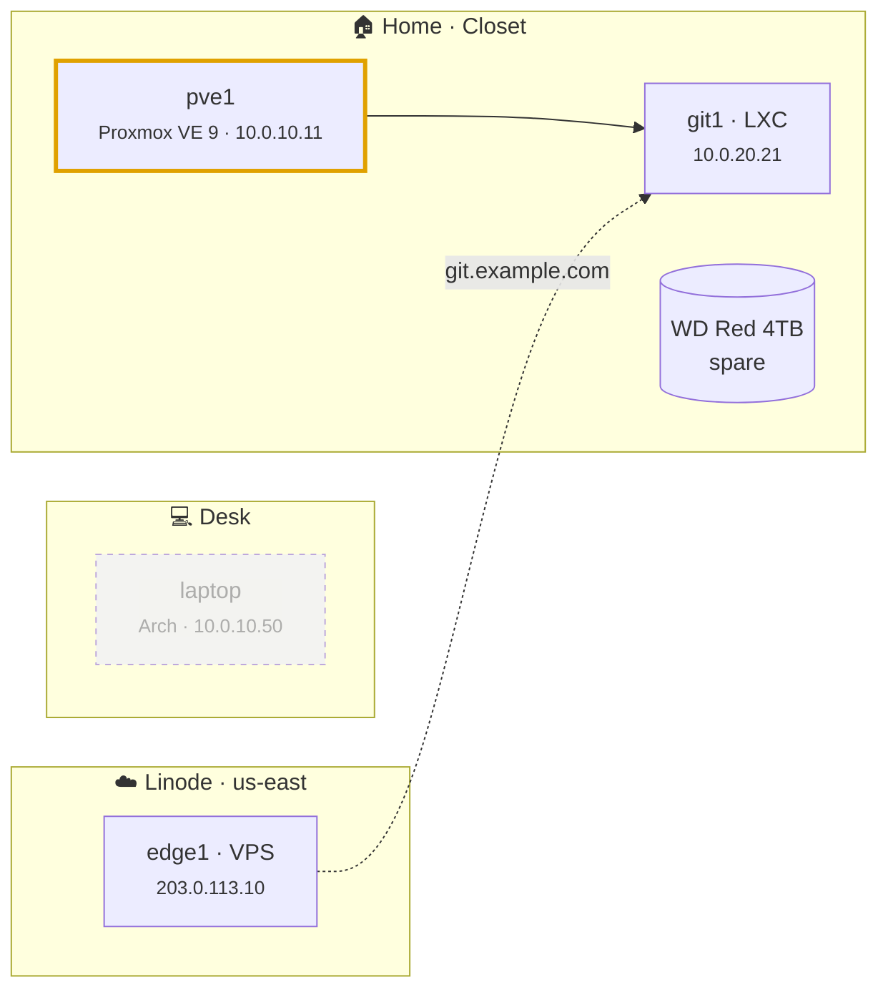

## What's where

```mermaid
flowchart LR
  subgraph Home["🏠 Home · Closet"]
    direction TB
    pve1["pve1<br/><small>Proxmox VE 9 · 10.0.10.11</small>"]
    git1["git1 · LXC<br/><small>10.0.20.21</small>"]
    spare[("WD Red 4TB<br/>spare")]
    pve1 --> git1
  end
  subgraph Desk["💻 Desk"]
    laptop["laptop<br/><small>Arch · 10.0.10.50</small>"]
  end
  subgraph Linode["☁️ Linode · us-east"]
    edge1["edge1 · VPS<br/><small>203.0.113.10</small>"]
  end
  edge1 -. "git.example.com" .-> git1
  classDef warn stroke:#e0a100,stroke-width:3px;
  classDef down stroke-dasharray: 4 4,opacity:0.6;
  class pve1 warn
  class laptop down
```

Full maps: [[maps/virtual|Virtual]] · [[maps/logical|Logical]] · [[maps/physical|Physical]]
