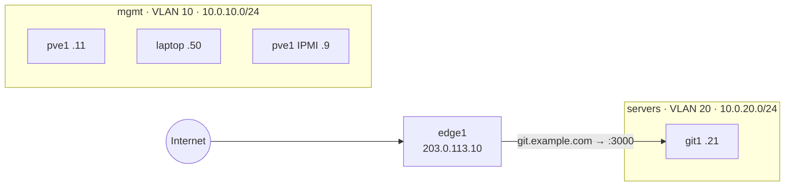

# Logical map

```mermaid
flowchart LR
  internet((Internet)) --> edge1["edge1<br/>203.0.113.10"]
  subgraph mgmt["mgmt · VLAN 10 · 10.0.10.0/24"]
    pve1["pve1 .11"]
    laptop["laptop .50"]
    oob["pve1 IPMI .9"]
  end
  subgraph servers["servers · VLAN 20 · 10.0.20.0/24"]
    git1["git1 .21"]
  end
  edge1 -- "git.example.com → :3000" --> git1
```
