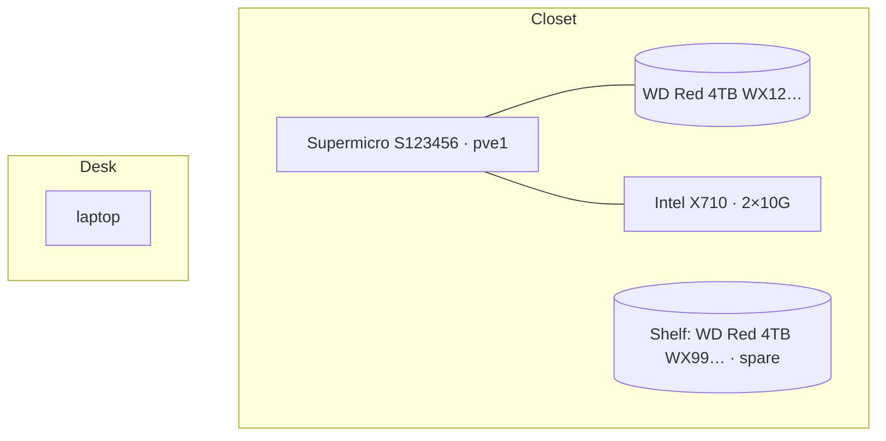

# Physical map

```mermaid
flowchart TB
  subgraph Closet
    chassis["Supermicro S123456 · pve1"]
    chassis --- d1[("WD Red 4TB WX12…")]
    chassis --- nic["Intel X710 · 2×10G"]
    shelf[("Shelf: WD Red 4TB WX99… · spare")]
  end
  subgraph Desk
    laptop["laptop"]
  end
```
